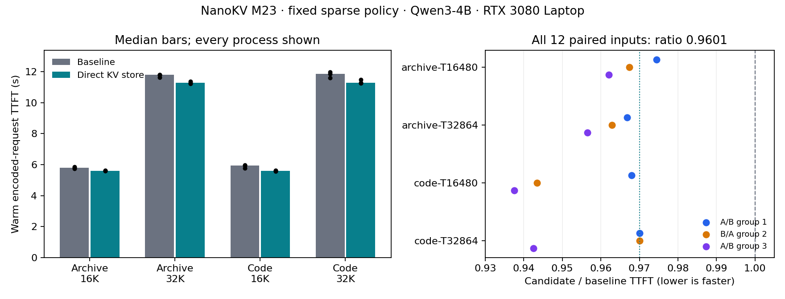

# NanoKV M23：固定稀疏策略下的首 token 优化

2026-10-07。本轮完成“定位额外复制 → 保持输出的修改 → Nsight 路径核对 → 独立进程基准”证据链。
在下述四条工程输入、三组配对进程上，encoded-request warm TTFT 的 candidate/baseline
几何平均比值为 **0.960055，延迟下降 3.99%**。预先登记的 ≥3% 总体收益、每组有收益、
每输入三组平均不回退三个门槛均通过。它是一个有限范围的系统收益，不代表生产流量或普遍模型质量。



## 1. 先定位，再选修改

旧的 Torch profiler 汇总误用了 CPU/device 字段；本轮保留原始记录，以 Chrome 实际区间和 CUDA
correlation 重建归因。主 chunk 的 CPU gather 约32ms；selector/store 的 CPU 标签很长，却包含等待 GPU
完成既有工作，不能全部当作 CPU 算法时间。因此没有直接按“gather 是最大瓶颈”来选优化。

源代码中存在一处具体重复工作：每层把当前 K、V 从 GPU 复制成临时 pageable CPU 张量，再复制到
CPU 历史缓存。候选仅将两个保存语句改成阻塞的直接 GPU→历史缓存复制。

```python
# 原路径：GPU → 临时 CPU → CPU 历史缓存
self.k_cpu[start_block:need].copy_(k_blocks.cpu())
self.v_cpu[start_block:need].copy_(v_blocks.cpu())

# 候选：直接写入 CPU 历史缓存；完成后才允许后续 gather
self.k_cpu[start_block:need].copy_(k_blocks, non_blocking=False)
self.v_cpu[start_block:need].copy_(v_blocks, non_blocking=False)
```

源张量可能不连续，依靠 PyTorch 的逻辑 copy 语义处理；没有假设新的布局。代表构造、padding、
缓存增长、sink/recent、选择顺序及 attention 均沿用原函数。候选 helper 校验原函数 SHA，并通过
反向替换证明生成函数只改变这两个语句；只绑定到实验 runtime 实例。冻结的 M12 默认源文件未修改。
这是 opt-in 实验入口，尚未作为通用默认配置发布。

## 2. 冻结输入和测量边界

| 项目 | 固定设置 |
| --- | --- |
| 模型 | Qwen3-4B，revision `1cfa9a7208912126459214e8b04321603b3df60c`；13个文件前后完整重哈希 |
| 主机 | RTX 3080 Laptop 16GiB / SM86，driver595.91.07，native Ubuntu26.04.1 |
| 环境 | Python3.12.14，Torch2.7.1+cu128，Triton3.3.1，FA2 2.8.3.post1 |
| 执行 | BF16、TP1、eager、FlashAttention、8 CPU threads；TF32及BF16 reduced precision reduction关闭 |
| 稀疏策略 | block64、r4、prefill/decode Top32、sink64、recent512、mean Q-summary1、chunk4096、原 YaRN factor4 |
| 其他路径 | pinned index_select gather；dynamic budget、selector Graph/static mask、decode pipeline及operator adapter关闭 |
| 输入 | archive/code 各16480与32864 token；四/八个4096主块，随后96尾块 |
| 构造 | pinned tokenizer 编码既有 prompt unit，再重复 unit IDs并截断；16480前缀与旧bridge输入完整相同 |
| 主指标 | 已编码请求 enqueue 到生成首 token；每个engine step后同步 |
| 排除 | tokenizer、模型加载、显式 sparse_reset、预热、状态hash、profile、文件写入 |
| 顺序 | 先两臂完整审计，再三对新进程 A/B、B/A、A/B；每进程先预热一条32K请求 |

输入是重复的工程文本，**不是生产样本、质量集或盲 holdout**。这里测单请求已预热引擎的 TTFT，
不包含网络/排队延迟，也没有测吞吐、cold-start 或 TPOT。配置与请求含完整 token IDs/source SHA；
测量时的 parent HEAD 为 `4868321`，新增实验文件尚未提交时已逐文件冻结哈希。

## 3. 输出一致性与完整覆盖

正式审计使用独立进程，每条输入生成16个greedy token。两臂以下数据全部一致：

- attention 输出完整字节 SHA：16K 每臂每输入720次（20步×36层），32K 864次（24步×36层），无缺层或重复；
- 每个 prefill chunk、每层 selected block IDs 的顺序、logical lengths、保护集合；
- 首 token 时所有已用 CPU K/V（含padding）、representatives、sink/recent 的字节hash；
- 每输入16个生成token；每层15次decode选择，每次32个ID；最终逻辑状态。

12个性能配对中，两臂首 token 均匹配完整baseline审计。性能阶段没有audit hooks/逐层hash。
这证明所测输入上的 bitwise 一致性，不是对所有输入的形式化证明，更不证明 sparse 与 dense 等价。

## 4. 无 profiler 的净 TTFT 结果

表中秒数是三进程的各臂中位数；下降百分比来自**配对比值的几何平均**，因此不要用中位数直接相除替代它。

| 输入 | baseline 中位数 / s | direct store 中位数 / s | 配对TTFT下降 |
| --- | ---: | ---: | ---: |
| archive 16480 | 5.789 | 5.601 | 3.20% |
| archive 32864 | 11.805 | 11.291 | 3.80% |
| code 16480 | 5.952 | 5.585 | 5.05% |
| code 32864 | 11.858 | 11.299 | 3.92% |
| 全部12配对 | — | — | **3.99%** |

三组分别下降3.02%、3.91%、5.04%，12个单独配对均改善（2.56%–6.25%）。96-token tail 并非稳定
单独改善：存在7.89%的单次回退；原始尾块结果全部保留，不筛掉不利记录。主要收益在4096-token主块。
该笔记本未锁频；性能进程结束温度67–71℃、时钟1785–1800MHz。顺序平衡降低顺序偏差，三组仍有限，
没有声称统计置信区间或跨主机普遍性。GPU峰值allocation两臂均8.529GiB；不声称显存或RSS节省。

## 5. Nsight 解释了什么

两臂分别捕获 archive16480 的零起始 step3，即已有12288历史token后的第四个4096主块。
关闭 CPU sampling/context switches，不使用硬件计数器；CLI时间线在普通用户权限下成功。
profile 包装给原计算函数增加NVTX，因此即便标为baseline，也不是“完全无仪器的方法绑定”。

以下是36层NVTX CPU区间的inclusive合计，**不是净benchmark**：

| 标签 | baseline / ms | candidate / ms |
| --- | ---: | ---: |
| K保存 | 401.84 | 372.66 |
| V保存 | 91.04 | 67.57 |
| CPU gather | 30.50 | 31.56 |
| selector | 767.70 | 780.08 |

每臂每个K/V保存子区间均关联36次8MiB DtoH，总计各288MiB；API包含36次MemcpyAsync和36次
StreamSynchronize。GPU DtoH持续时间约54–57ms/组，没有减少数据量。K保存区间还与前面提交的
FA2 kernels重叠约312–317ms，说明其很大部分是等待既有attention完成。

K保存“位于CUDA API区间之外”的主机时间从24.60ms降到2.08ms，V从28.61ms降到4.69ms。
这与移除额外主机复制的源代码差异一致，但该残余还包含其他开销；Nsight没有直接跟踪PyTorch CPU
memcpy，不能把残余全叫作memcpy成本或可回收预算。correlation描述区间内提交的GPU工作，temporal
overlap描述同时发生的工作，两者都不等于独占关键路径，不能把重叠CPU/API/GPU时间相加。

selector标签的剩余大区间应先追上游GPU依赖与隐式同步，再判断是否需要优化selector计算。
本轮没有修改representative K或Q-summary来改变质量预算。

## 6. 证据和复现

- 冻结协议：[NATIVE_PREFILL_TTFT_OPTIMIZATION_PLAN.md](NATIVE_PREFILL_TTFT_OPTIMIZATION_PLAN.md)
- live evidence复核：[final-evidence-check-v2.json](../benchmarks/results/native_ttft/final-evidence-check-v2.json)
- 输入再生：[fixture-regeneration-check.json](../benchmarks/results/native_ttft/fixture-regeneration-check.json)
- Nsight归因：[nsys-analysis.json](../benchmarks/results/native_ttft/nsys-analysis.json)，采集哈希：[manifest](../benchmarks/results/native_ttft/nsys-capture-manifest.json)
- 原始CPU records/source打包：`benchmarks/results/native_ttft/evidence.tar.gz`；离线核对见 `archive-verification.json`
- 原始profile报告保留在本机 ignored `bench_logs/m23-nsys/`；可能含环境元数据，不包含在可分享archive中。
- 完整正式suite本机路径：`bench_logs/m23-final-suite-v1/suite.json`。初期pilot和旧Chrome归因原样保留于CPU archive，未计入headline。

在native checkout执行；输出必须用新的目录/文件，不能覆盖旧记录：

```bash
source .venv/bin/activate
unset CUDA_HOME CUDA_PATH CUDACXX LD_LIBRARY_PATH
export HF_HUB_OFFLINE=1 TRANSFORMERS_OFFLINE=1 OMP_NUM_THREADS=8 MKL_NUM_THREADS=8
python benchmarks/run_native_ttft_suite.py \
  --model /home/tmz/models/Qwen3-4B \
  --fixture benchmarks/results/native_ttft/fixture.json \
  --output bench_logs/m23-reproduction
python benchmarks/check_native_ttft_evidence.py \
  --suite bench_logs/m23-reproduction/suite.json \
  --fixture benchmarks/results/native_ttft/fixture.json \
  --output bench_logs/m23-reproduction-check.json
```

完整live checker重哈希13个模型文件、当前source和8个worker，并独立重算exact audit/12个配对。
原始records含采集主机绝对路径；其他机器应改成自己的model/checkout路径重新跑suite。可以不使用GPU
核对可分享archive中的文件哈希、记录完整性与配对数学结果（它不验证当前模型/主机）：

```bash
python3 benchmarks/package_native_ttft_evidence.py verify \
  --archive benchmarks/results/native_ttft/evidence.tar.gz \
  --output /tmp/m23-archive-check.json
```

Nsight复现与GUI查看步骤见 [NATIVE_NSIGHT_GUIDE.md](NATIVE_NSIGHT_GUIDE.md)。图由Matplotlib3.10.7
在独立临时报告环境生成，未向NanoKV venv安装绘图库；`plot_native_ttft.py`只读取已完成的suite。
本轮运行的是授权的benchmark/profiling与CPU证据审计，没有增加或运行unit tests。

## 7. 项目边界与后续决策

本轮给推理引擎项目补上了固定稀疏策略下的正收益，算子项目仍为独立仓库；既有operator bridge
未获得稳定完整prefill加速的结果保持原结论。CPU offload减少GPU历史存储负担，本轮解决的是其
保存路径里的额外主机复制，不声称消除了所有prefill/gather瓶颈。

M22已发现稀疏配置的质量缺口，尤其32K multi-key；本轮复制优化不修复它。下一步若改representative
K、Q-summary、TopK或配额，需要先由用户选任务质量门槛和允许的延迟/答案变化，再冻结dev/holdout
协议。可讨论选项与已有证据见 [NATIVE_RETRIEVAL_TRADEOFFS.md](NATIVE_RETRIEVAL_TRADEOFFS.md)。
